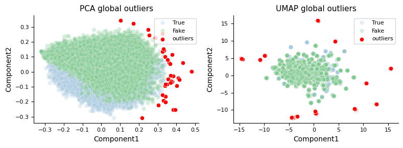
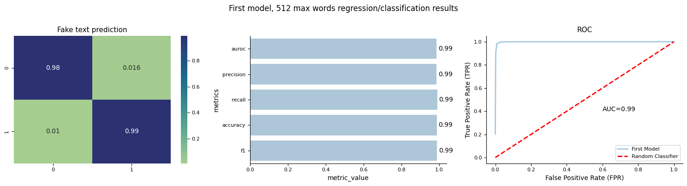
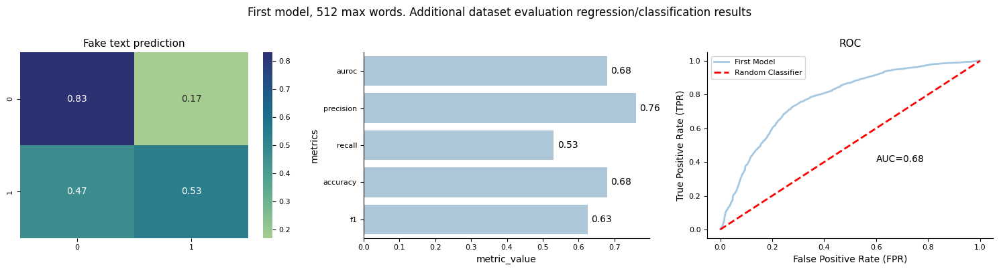
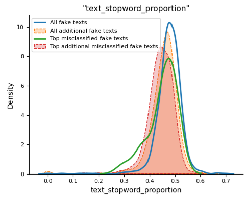
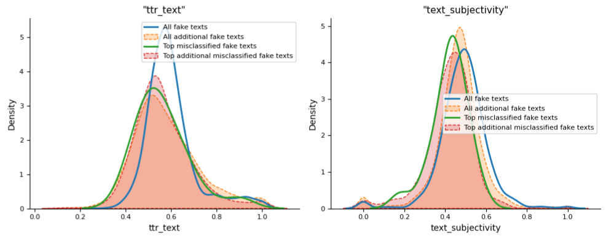
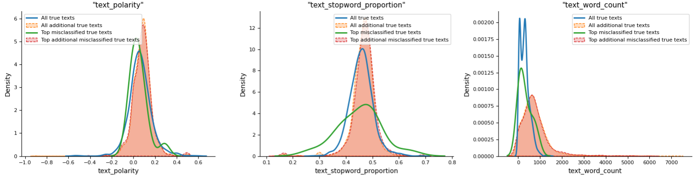
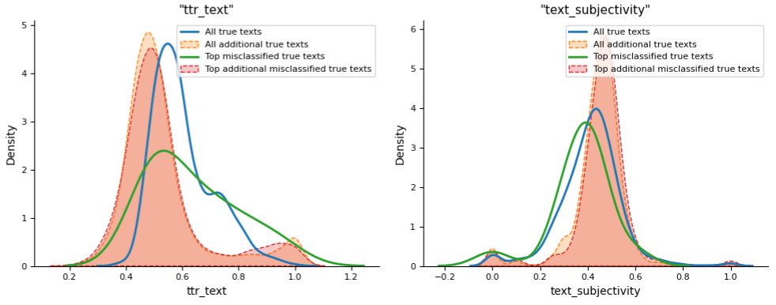

# Fake information classification

## Background

Misinformation is one of the challenges that are faced worldwide. Incorrect information can be harmless in some context, but can be devastating in others. False information influences the huge polarization, hate and conflict in the society. In some contexts, fake news can even influence democratic elections.

## Contents

Contents are made up of two datasets containing true and fake information. Each dataset consists of title, text, subject and date of articles.

## Goal

Classify articles into true and fake.

## Objectives

* Perform EDA - identify how fake articles differ from true. Find most predictive features.
* Use heuristic rules as baseline for article prediction.
* Make machine learning models with engineered features and texts.
* Build a deep-learning model.
* Compare model performance.
* Identify where the model is underperforming. Analyze misclassified items.

## Table Of Contents

* [Fake information classification](#toc1_)
  * [Background](#toc1_1_)
  * [Contents](#toc1_2_)
  * [Goal](#toc1_3_)
  * [Objectives](#toc1_4_)
  * [Configuration](#toc1_5_)
  * [EDA](#toc1_6_)
    * [Missing data and duplicates](#toc1_6_1_)
    * [Data distributions and associations](#toc1_6_2_)
      * [Text/Title word count](#toc1_6_2_1_)
      * [Empty text/title articles](#toc1_6_2_2_)
      * [Longest/Shortest text/title articles](#toc1_6_2_3_)
      * [Article subject distributions](#toc1_6_2_4_)
      * [Article dates](#toc1_6_2_5_)
    * [Caps words](#toc1_6_3_)
    * [Analysis of repettitive words](#toc1_6_4_)
    * [Common words in fake article text/title](#toc1_6_5_)
    * [Special characters, tags etc](#toc1_6_6_)
    * [Analysis of common topics](#toc1_6_7_)
    * [Vocabluary size and richness](#toc1_6_8_)
    * [Stopword frequency](#toc1_6_9_)
    * [Text/title similarity](#toc1_6_10_)
    * [Language analysis](#toc1_6_11_)
    * [Part-of-speech tagging](#toc1_6_12_)
    * [Sentiment and Emotional Analysis](#toc1_6_13_)
    * [Emotions in text](#toc1_6_14_)
    * [Semantic Analysis](#toc1_6_15_)
    * [Noise and Outlier Detection](#toc1_6_16_)
    * [Text cleaning](#toc1_6_17_)
    * [Train/validation/test data split](#toc1_6_18_)
  * [Classification models](#toc1_7_)
    * [Building a heuristic model](#toc1_7_1_)
    * [Machine learning classifier models from features](#toc1_7_2_)
      * [Explanation of models trained on features](#toc1_7_2_1_)
    * [Machine learning classifier models from text](#toc1_7_3_)
    * [Evaluation of classifier models](#toc1_7_4_)
      * [Additional dataset preprocessing and modeling](#toc1_7_4_1_)
    * [Deep-learning classifier training](#toc1_7_5_)
      * [Feature importance explanation using SHAP.](#toc1_7_5_1_)
    * [Model misclassifications](#toc1_7_6_)
      * [Catboost classifier. Engineered features](#toc1_7_6_1_)
      * [XGBoost classifier trained on text. Text preprocessing pipeline one.](#toc1_7_6_2_)
      * [Distilbert classifier. Trained on text preprocessed by the first pipeline](#toc1_7_6_3_)
      * [Distilbert model trained on texts preprocessed by the second pipeline.](#toc1_7_6_4_)
  * [Summary](#toc1_8_)
    * [Suggestions for further improvement](#toc1_8_1_)

### Summary

**Data cleaning**

* Articles empty of text were dropped.
* Fully duplicated articles, articles that had duplicated texts or titles and articles that had highly similar (similarity > 0.7) texts were dropped from the analysis.

* Outliers were identified by vectorizing texts and reducing the dimensions by UMAP or PCA. Texts furthest from the others in reduced representation were removed.

**Data preprocessing**

Texts were preprocessed using 8 different pipelines. Preprocessing methods included in the pipelines were:

* Lowercasing text
* Removing part or all punctuation
* Addressing stopwords - removing part or all.
* Removing proper nouns and named entities.
* Lemmatizing text.
* Cleaning whitespaces.
* Addressing special characters, numbers, hashes and others.

**Model's characteristics**

*Orginal dataset*

'

*Additional dataset*

'

Trained Distilbert classifier achieved 0.99 accuracy and ROC AUC on original dataset. Model achieved 0.68 accuracy and ROC AUC on additional dataset.

**Misclassified texts**

*Misclassification of 'fake' texts*

'
'

* Misclassified 'fake' texts had lower type-token ratio, subjectivity and slighly lower proportion of stopwords.
* Additional 'fake' texts had very similar subjectivity and type-token ratio distribution as misclassified 'fake' texts from the original dataset. They also had slighly lower text stopword proportion.

---
*Misclassification of 'true' texts*

'
'

* Misclassified 'true' texts from the original dataset had very broad type-token ratio and stopword proportion distributions with higher proportion of very high values. Text subjectivity and polarity were slightly lower.
* Additional 'true' texts had lower' type-token ratio, higher text subjectivity, polarity and text word count.
