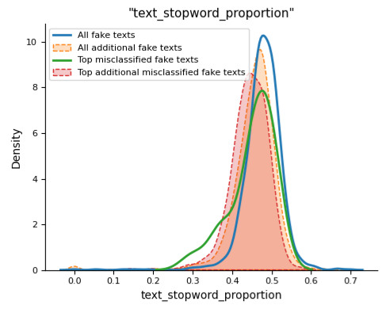
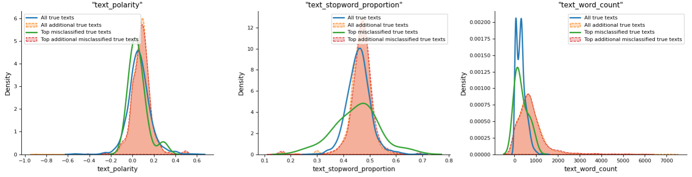

# Fake information classification

## Background

Misinformation is one of the challenges that are faced worldwide. Incorrect information can be harmless in some context, but can be devastating in others. False information influences the huge polarization, hate and conflict in the society. In some contexts, fake news can even influence democratic elections.

## Contents

Contents are made up of two datasets containing true and fake information. Each dataset consists of title, text, subject and date of articles.

## Goal

Classify articles into true and fake

## Objectives

* Perform EDA - identify how fake articles differ from true. Find most predictive features.
* Use heuristic rules as baseline for article prediction.
* Make machine learning models with engineered features and texts.
* Build a deep-learning model.
* Compare model performance.
* Identify where the model is underperforming. Analyze misclassified items.

## Data review and cleaning

* Articles empty of text were dropped.
* Fully duplicated articles, articles that had duplicated texts or titles and articles that had highly similar (similarity > 0.7) texts were dropped from the analysis.

* Outliers were identified by vectorizing texts and reducing the dimensions by UMAP or PCA. Texts furthest from the others in reduced representation were removed.

## EDA

**Caps words.**

* Number of all-caps words was different in 'true' and 'fake' text groups. 'Fake' texts have more all-caps words in texts and titles.

---

**Wordcloud. Frequent words in text classes.**

* Words like 'Reuters', 'WASHINGTON' and others were found to be disproportionally frequent between true information texts.
* Words indicating locations or news services were removed from start of texts as these were indications of 'true' texts.

---

**Attention words**

* Attenion words such as 'SHOCKING', 'BREAKING' 'ILLEGAL' 'WOW' and others were showed to be overused in 'fake' texts.

---

**Special characters, symbols, numbers and tags**

* Special characters in texts:

* Special characters in titles:

* Special character combinations in texts:

* HTML tags, URL links, and other special characters were used more often in 'fake' articles.
* Combination of URL links, special characters, numbers and hashes were >250 times more offtenly used in 'fake' articles.
* Other special character combinations - URL links with special characters and URL links with special characters and numbers were >20 times more frequent between fake texts.

---

**Text contexts**

 

* Both 'fake' and 'true' articles had similar topics of socio-economic and political news.

---

**Lexical diversity**

'

* Lexical diversity calculation of type-token ratio showed similar trends in both 'true' and 'fake' article groups. However, there was a higher proportion of 'true' texts with high lexical diversity.

'

* Word frequencies in both true and fake texts showed alienation from the power law distribution.

---

**Stopwords**

'

* Stopword frequencies were higher between 'fake' texts.

---

**Part-of-speech tagging**

'

'

* Part-of-speech tagging indicated significant differences between 'fake' and 'true' texts.

---

**Sentiment analysis**

'

* Sentiment analysis showed higher average text subjectivity between 'fake' articles but similar polarity.

---

**Emotions**

'

* All emotions tested showed siginificant differences between article groups.

---

**Semantic analysis**

'

* 3 Distinct 'true' text groups were identified in the semantic analysis that differed by:
  * Subject distribution
  * Text word count
  * Title word count
  * Combinations of special characters
  * Type-token ratio
  * Subjectivity

---

## Data preprocessing before modeling

* Texts were processed by 8 different pipelines:
  * *pipeline short*:
    * Cleaning the punctuation without removal
    * Cleaning whitespaces
    * Changing special tags with custom tokens

  * *pipeline long*:
    * Fixing misspelled words
    * Lemmatization of words
    * Cleaning punctuation without removal
    * Cleaning whitespaces
    * Changing special tags with custom tokens

  * *pipeline one*:
    * Removing named entities and proper nouns
    * Removing all special characters, HTML tags, links etc.
    * Removing all punctuation
    * Cleaning whitespaces

  * *pipeline two*:
    * Lowercasing text
    * Changing 't' to 'not'
    * Removing @name
    * Removing all punctuation except '?'
    * Removing all other special characters, links, tags etc.
    * Removing stopwords except 'not' and 'can'
    * Cleaning whitespaces

  * *pipeline three*:
    * Lowercasing text
    * Removing all special characters, HTML tags, links etc.
    * Removing all punctuation except '?', '!', '.'
    * Removing all stopwords
    * Cleaning whitespaces

  * *pipeline four*:
    * Lowercasing text
    * Removing all special characters, HTML tags, links etc.
    * Removing all punctuation except '?', '!', '.'
    * Removes repeated words in a text
    * Cleaning whitespaces

  * *pipeline five*:
    * Removing named entities and proper nouns
    * Lowercasing text
    * Changing 't' to 'not'
    * Removing all special characters, HTML tags, links etc.
    * Removing all punctuation except '?', '!', '.'
    * Removing stopwords except 'not' and 'can'
    * Cleaning whitespaces

  * *pipeline six*:
    * Removing named entities and proper nouns
    * Lowercasing text
    * Changing 't' to 'not'
    * Removing all special characters, HTML tags, links etc.
    * Removing all punctuation except '?', '!', '.'
    * Removes repeated words in a text
    * Cleaning whitespaces

## Classification models

### Heuristic model

---

* For text classification the following features were used to identify texts:
  * title all-caps words proportion
  * proportion of longer all-caps words in texts
  * special character composition in title
  * proportion of special characters and numbers in titles
  * type-token ratio
  * subjectivity
  * stopwords proportion to text length
  * text emotions

'
'

* Model achieved accuracy of 0.778 on test set from the original dataset.
* Model achieved accuracy of 0.561 on additional dataset from the other source.

### Machine learning models with engineered features

---

* Models used the same features as used in heuristic approach
* In total 5 models were trained: logistic regression, decision tree classifier, LGBM classifier, XGBoost classifier and Catboost classifier.

*Original dataset*

'

*Additional dataset*

'

* The best results were achieved by Catboost classifier: 0.940 accuracy and 0.985 ROC AUC on original dataset. On additional data the model achieved 0.622 accuracy and 0.699 ROC AUC.

---
'

* The most important features in machine learning models were showed to be caps words proportion in titles, stopword proportion in texts, special characters proportion in titles, text subjectivity and emotion disgust.

### Machine learning models with text

---

* Text was preprocessed by 8 pipelines described above.

*Original dataset. Sample pipelines*

*Additional dataset. First Pipeline*

'

*Additional dataset. Fourth Pipeline*

'

* Best performance was achieved by XGBoost classifier which achieved 0.961 accuracy and 0.993 ROC AUC on the original dataset and 0.701 accuracy and 0.762 ROC AUC on the additional dataset. Model was trained on texts preprocessed by the first pipeline.

'

* The most important words were showed to be 'said', 'image', 'just', 'featured' and others in model where texts were processed without removal of stopwords but with proper nouns removed.

### Deep learning models with text

---

* Texts were preprocessed using 8 pipelines described above.

*Orginal dataset*

'

*Additional dataset*

'

* Best performance was achieved by distilbert classifier trained on texts preprocessed by the first pipeline (proper nouns removal). Accuracy and ROC AUC reached 0.99 on original dataset and accuracy/ROC AUC of 0.68 on additional dataset.
* SHAP explanations showed high model's dependence on class-specific words/phrases and lower use of context in its predictions.

## Misclassifications

**Catboost classifier trained on engineered features**

*Misclassification of 'fake' texts*

'
'
'

* Misclassified 'fake' texts showed lower all-caps words proportion in titles, lower type-token ratio, subjectivity and stopwords proportion in texts.
* Additional 'fake' texts were similar both correctly and incorrectly classified. They showed lower all-caps proportion in titles, lower type-token ratio, subjectivity and stopwords proportion in texts and higher emotion values. Additional 'fake' texts showed similarities to misclassified 'fake' texts from the original dataset.

  ---

*Misclassification of 'true' texts*

'
'
'

* Misclassified 'true' texts showed higher all-caps words proportion in titles, higher subjectivity and stopword proportion in texts.
* Additional 'true' texts were similar both correctly and incorrectly classified. They showed wider range in proportion of special characters in titles, lower type-token ratio, higher text subjectivity and stopword proportion. By subjectivity and text stopword proporion additional 'true' texts were closer to misclassified true texts from the original dataset.

---

**XGBoost classifier trained on texts, processed by the first pipeline.**

*Misclassification of 'fake' texts*

'
'

* Misclassified 'fake' texts had lower stopword proportion in texts and slightly lower subjectivity.
* 'Fake' texts from the additional dataset, both correctly and incorrectly classified showed lower type-token ratio, text subjectivity, text stopword proportion.

---
*Misclassification of 'true' texts*

'
'

* Misclassified 'true' texts had slighly higher type-token ratio, and stopword proportion.
* Additional 'true' texts had lower type-token ratio and lower text-stopword proportion.

---

**Distilbert classifier trained on texts, processed by the first pipeline.**

*Misclassification of 'fake' texts*

'
'

* Misclassified 'fake' texts had lower type-token ratio, subjectivity and slighly lower proportion of stopwords.
* Additional 'fake' texts had very similar subjectivity and type-token ratio distribution as misclassified 'fake' texts from the original dataset. They also had slighly lower text stopword proportion.

---
*Misclassification of 'true' texts*

'
'

* Misclassified 'true' texts from the original dataset had very broad type-token ratio and stopword proportion distributions with higher proportion of very high values. Text subjectivity and polarity were slightly lower.
* Additional 'true' texts had lower' type-token ratio, higher text subjectivity, polarity and text word count.

---

**Distilbert classifier trained on texts, processed by the second pipeline**

*Misclassification of 'fake' texts*

'
'

* Misclassified 'fake' texts had lower text subjectivity, wider range of text polarity, and lower text-stopword proportion. All emotions had lower median value and narrower range.
* Additional 'fake' texts had slightly lower text subjectivity, low text stopword proportion and wider range of emotion values with higher median value. Misclassified additional 'fake' texts had only slightly lower subjectivity compared to all additional 'fake' texts.

---
*Misclassification of 'true' texts*

'
'
'

* Misclassified 'true' texts had similar distribution of type-token ratio in texts with higher proportion of higher parameter values. Misclassified texts showed lower text polarity and higher on average text stopword proportion.
* Additional 'true' texts showed different type-token ratio distribution with dominating values being lower. These texts had higher subjectivity and low text-stopword proportion. Emotion ranges were wider and higher.

---

## Model selection

* In total there have been 6 engineered-feature-based models. From these models Catboost classifier showed the best results on test data (0.94 accuracy, 0.96 ROC AUC) and additional data (0.63 accuracy and 0.70 ROC AUC). However, models performance on additional data was not good enough to select the model as the best performing.
* In total there have been 8 text preprocessing pipelines prepared. With each pipeline 5 models were trained and evaluated on the original dataset and the additional dataset. The best performance was showed by the XGBoost classifier that reached 0.96 accuracy and 0.99 ROC AUC on original data and 0.70 accuracy and 0.76 ROC AUC on additional data. However, the most important features were showed to be specific words like `said`, `image` and others that were more associated with one of the text classes.
* In total 6 deep learning models were fitted using pre-trained distilbert text classifier. Each model used different text preprocessing pipeline. The best results were showed by the model trained on texts preprocessed by the first pipeline and second pipeline. Models reached 0.99 accuracy and ROC AUC on the original dataset and 0.68/0.67 accuracy and ROC AUC on the additional data respectively. Misclassified text analysis revealed the following features as having importance in model's predictions:

*First pipeline model:*
    *Subjectivity
    * Type-token ratio
    *Polarity
    * Stopwords proportion

*Second pipeline model*
    *Subjectivity
    * Type-token ratio
    *Polarity
    * Stopwords proportion
    * Emotions

Although both models showed association between mislassified texts and stopword proportion, model trained on texts from the first pipeline showed lower dependence even though most of the stopwords in the second pipeline are removed. Because of this reason, distilbert model trained on pipeline one is selected.

## Suggestions for further improvement

1) Dataset expansion. As all 'true' texts from the original dataset came from the same source they show similar style and context. This is the reason why all of the trained models put their attention on class-specific words rather than context. Including additional texts from different subjects and sources would greatly increase generalization.
2) None of the trained models were tuned for hyperparameters. I did not perform this tuning as models were already well-performing on the original dataset and tuning them would not help predicting data from other sources.
3) Performing more in-depth text preprocessing steps - text augmentation with text translation, use of synonimous words and other methods could be applied to get better generalizing datasets.
4) A more in depth analysis of feature importance and misclassified texts could be done.
